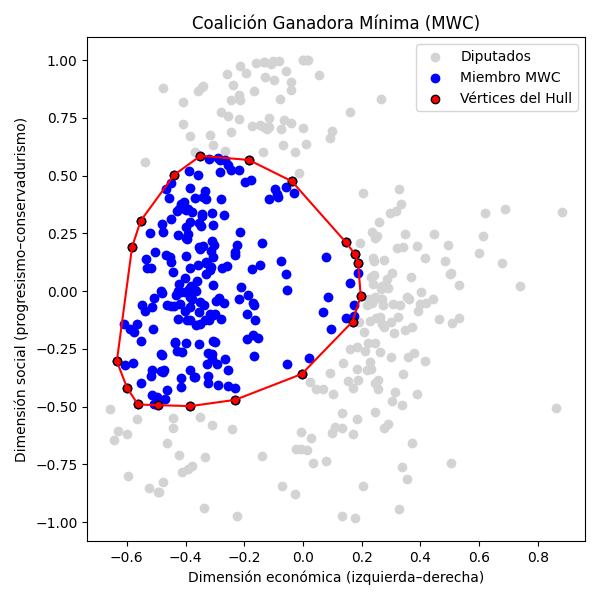

# 🧬 Algoritmo Genético para Coalición Ganadora Mínima (CGM)

Este repositorio contiene una implementación en **Python** de un **Algoritmo Genético** diseñado para encontrar una **Coalición Ganadora Mínima (MWC)** dentro de la Cámara de Representantes de EE.UU., utilizando información ideológica proveniente de las coordenadas **DW-NOMINATE**.

📌 El objetivo es identificar un subconjunto de **217 legisladores** que:
- Cumpla con el **quórum necesario** para aprobar una votación.
- Tenga la **mínima dispersión ideológica interna**, medida por la suma de distancias euclídeas entre todos los miembros.

---

## 📚 Basado en:

> **Coalición Ganadora Mínima: Implementación mediante Algoritmo Genético**, Lincolao-Venegas et al., 2023  
> *(Artículo académico disponible en este repositorio)*

---

## 📁 Archivos principales

| Archivo                  | Descripción                                                                 |
|--------------------------|------------------------------------------------------------------------------|
| `AlgoritmoGenetico.py`   | Script principal con el algoritmo genético.                                 |
| `VoteData.json`          | Datos de votación con coordenadas DW-NOMINATE de los legisladores.          |
| `coalicion_mwc.png`      | Gráfico generado que muestra la coalición encontrada en el espacio político.|
| `MWC_resultados.csv`     | Datos exportados de los miembros de la coalición ganadora.                  |

---

## 📷 Visualización de resultados

A continuación se muestra un ejemplo del gráfico generado automáticamente:



---

## 📑 Contenido del CSV (`MWC_resultados.csv`)

Este archivo contiene la lista de diputados seleccionados en la CGM, con los siguientes campos:

| idx | name           | party | x       | y       | es_vertice |
|-----|----------------|-------|---------|---------|-------------|
| 23  | Smith, John    | DEM   | -0.4321 | 0.2012  | 1           |
| ... | ...            | ...   | ...     | ...     | ...         |

- `es_vertice = 1` si el diputado está en el borde del *ConvexHull* (polígono ideológico exterior).

---

## 🛠️ Requisitos y dependencias

Este proyecto requiere **Python 3.8 o superior** y las siguientes bibliotecas:

```bash
pip install numpy scipy matplotlib